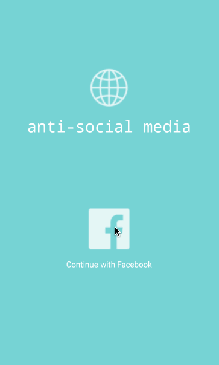
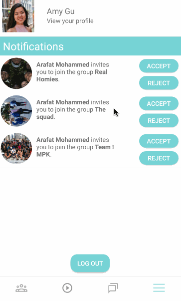
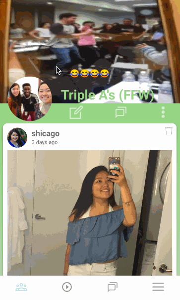
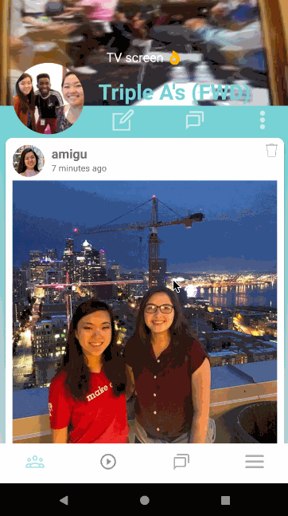

# *Anti-social Media*

**Anti-Social Media** is a social media platform designed for introverted people who prefer a more personal and intimate space to share with close friends. Anti-Social Media strives to be different from other social media platforms because it centers on allowing users to be themselves and to provide each other with emotional support. It focuses on the quality of connections rather than the quantity. 

## Summary of App Features

- User can log in using Facebook
- User can import friends from Facebook
- User can create customizable groups of one to several friends
- Each group has its own separate feed, story, and chat
- User can take or upload pictures and post to group feeds
- Users who are invited to groups receive in-app notifications that they can accept or decline
- User can customize groups' color scheme and like icons
- User can give friends "nicknames" that will show up as that friend's tagline on posts
- User can record, caption, and upload pictures and video to multiple group stories at once
- User can message other friends directly from their friends' posts
- User can leave likes and comments on posts
- User can upload pictures from Instagram and post to group feeds
- User receives push notifications alerting them to messages

## Video Walkthrough

Here's a walkthrough of implemented user stories:

GIF created with [LiceCap](http://www.cockos.com/licecap/).

## Credits

List an 3rd party libraries, icons, graphics, or other assets you used in your app.

- [Android Async Http Client](http://loopj.com/android-async-http/) - networking library

## License

    Copyright 2018 Arafat Mohammed, Alison Shikada, Amy Gu

    Licensed under the Apache License, Version 2.0 (the "License");
    you may not use this file except in compliance with the License.
    You may obtain a copy of the License at

        http://www.apache.org/licenses/LICENSE-2.0

    Unless required by applicable law or agreed to in writing, software
    distributed under the License is distributed on an "AS IS" BASIS,
    WITHOUT WARRANTIES OR CONDITIONS OF ANY KIND, either express or implied.
    See the License for the specific language governing permissions and
    limitations under the License.
